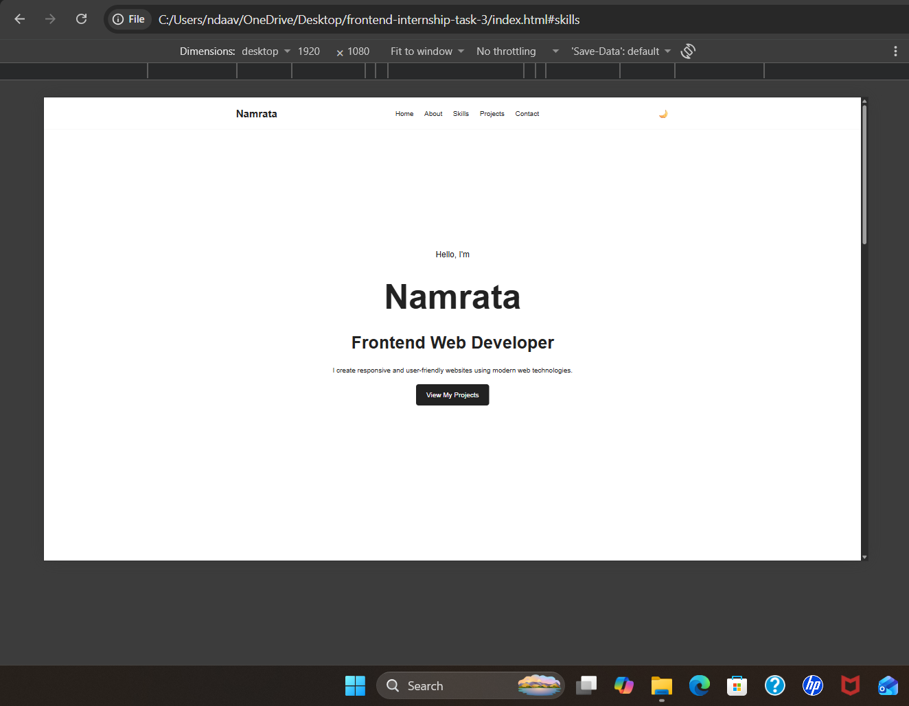
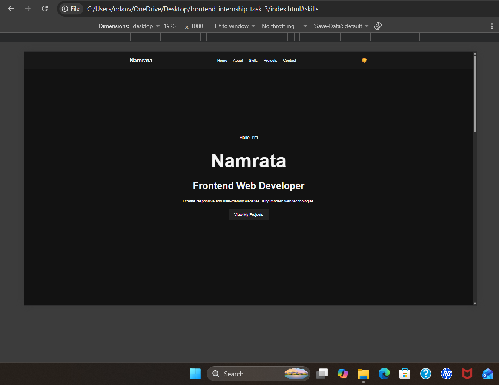
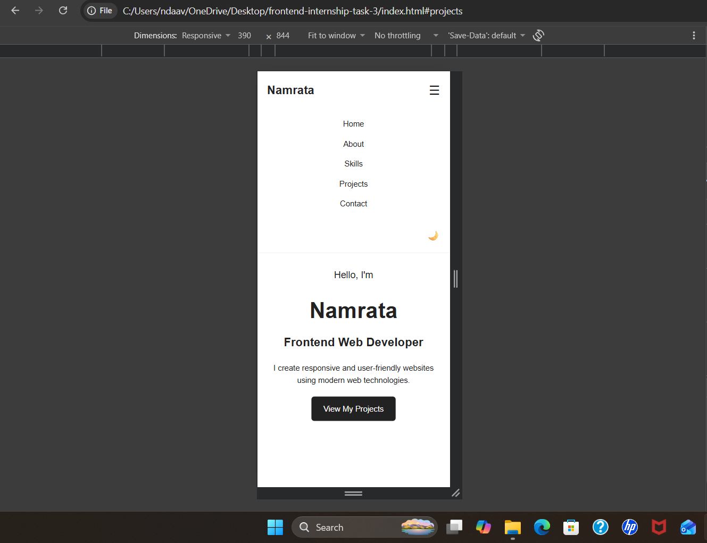
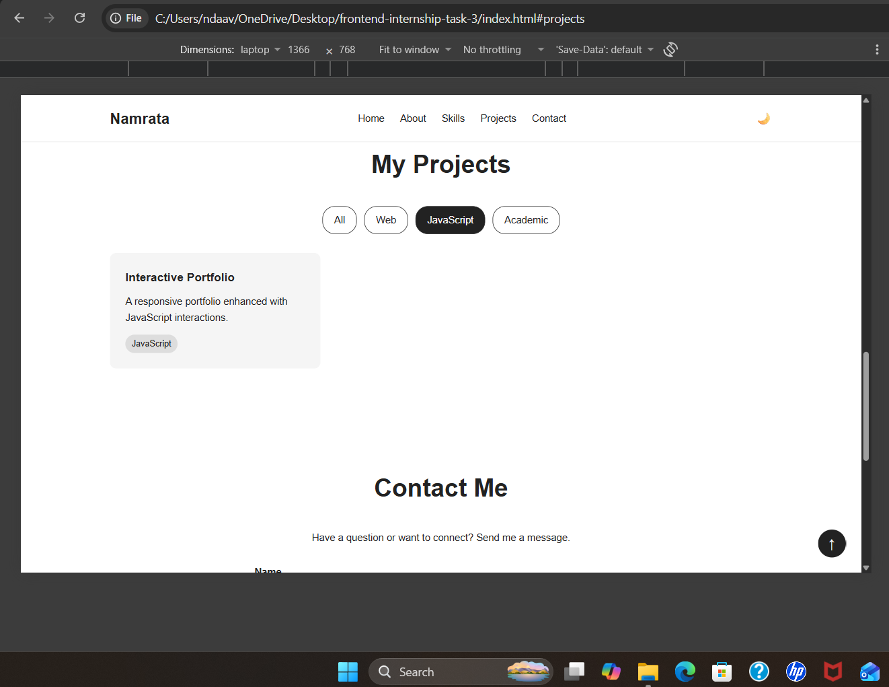
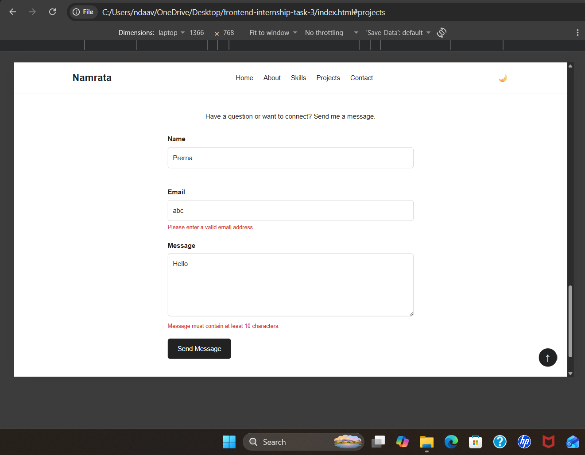

# Responsive Interactive Portfolio Website – Version 3
## YuvaIntern – Week 3 Task: Integrating JavaScript for Interactive User Experience

A responsive personal portfolio website enhanced with JavaScript-based interactive features. The project demonstrates DOM manipulation, event handling, client-side form validation, browser storage, responsive navigation, filtering, scrolling behavior and animation.

## 📌 Objective
The objective of this project is to transform a static responsive portfolio into an interactive web experience using plain JavaScript.
The implementation focuses on:
- DOM manipulation
- Event handling
- Dynamic content updates
- Form validation
- Browser localStorage
- Interactive navigation
- Scroll-based interactions
- Simple animations
- Responsive HTML/CSS/JavaScript integration

## 🛠️ Technologies Used
- HTML5
- CSS3
- JavaScript
- CSS Flexbox
- CSS Grid
- Media Queries
- DOM API
- IntersectionObserver API
- localStorage
- Git & GitHub

## 📁 Project Structure
```text
frontend-internship-task-3/
│
├── index.html
├── style.css
├── script.js
│
├── images/
│   └── workspace.png
│
├── Screenshot/
│   ├── DesktopLightmode.png
│   ├── DesktopDarkmode.png
│   ├── MobileNavigation.png
│   ├── ProjectFiltering.png
│   └── ContactFormValidation.png
│
└── README.md

✨ Interactive Features
1. Mobile Navigation
A responsive navigation menu was implemented using JavaScript.
How it works
•	Clicking the ☰ button opens the navigation menu. 
•	Clicking it again closes the menu. 
•	Clicking a navigation link automatically closes the mobile menu. 
•	The menu adapts to smaller screen sizes through CSS media queries. 
JavaScript concepts
•	addEventListener() 
•	classList.toggle() 
•	classList.contains() 
•	DOM element selection 
•	Attribute manipulation 
Example:
menuToggle.addEventListener("click", () => {
    navLinks.classList.toggle("active");
});

2. Dark / Light Mode
A theme switcher allows users to change between light and dark modes.
Features
•	🌙 button enables dark mode. 
•	☀️ button returns to light mode. 
•	Selected theme is stored using localStorage. 
•	The selected theme remains active after refreshing the page. 
JavaScript concepts
•	classList.toggle() 
•	localStorage.setItem() 
•	localStorage.getItem() 
•	Conditional statements 
Example:
const savedTheme = localStorage.getItem("theme");

if (savedTheme === "dark") {
    document.body.classList.add("dark-mode");
}

3. Project Filtering
The Projects section contains category filters:
•	All 
•	Web 
•	JavaScript 
•	Academic 
When a filter button is clicked, JavaScript checks the category assigned to each project and dynamically shows or hides the corresponding cards.
Example
Selecting JavaScript displays the Interactive Portfolio project while hiding projects belonging to other categories.
JavaScript concepts
•	querySelectorAll() 
•	dataset 
•	forEach() 
•	Dynamic style manipulation 
•	Event listeners 
Example:
projectCards.forEach((card) => {

    const category = card.dataset.category;

    if (
        selectedFilter === "all" ||
        category === selectedFilter
    ) {
        card.style.display = "block";
    } else {
        card.style.display = "none";
    }

});

4. Contact Form Validation
The contact form uses JavaScript for client-side validation.
The form validates:
•	Name 
•	Email 
•	Message 
Validation rules
Field	Validation
Name	Required and minimum 2 characters
Email	Required and valid email format
Message	Required and minimum 10 characters

Invalid input displays an appropriate error message.
A valid submission displays a success message and resets the form.
Important Note
This project demonstrates client-side validation only. The form does not send data to a backend server.
JavaScript concepts
•	Form submission events 
•	preventDefault() 
•	String methods 
•	Regular expressions 
•	Conditional statements 
•	DOM updates 

5. Back-to-Top Button
A back-to-top button appears after the user scrolls down the webpage.
Behavior
•	The ↑ button appears after approximately 400px of scrolling. 
•	Clicking the button smoothly returns the user to the top. 
•	The button disappears when the page returns near the top. 
Example:
window.scrollTo({
    top: 0,
    behavior: "smooth"
});
JavaScript concepts
•	Scroll events 
•	window.scrollY 
•	window.scrollTo() 
•	Smooth scrolling 

6. Scroll Reveal Animation
The portfolio uses the IntersectionObserver API to reveal sections and cards as they enter the viewport.
Elements include:
•	About section 
•	Skill cards 
•	Project cards 
•	Contact form 
The animation improves the visual experience without requiring continuous scroll calculations.
Example:
const observer = new IntersectionObserver(
    (entries, observer) => {

        entries.forEach((entry) => {

            if (entry.isIntersecting) {

                entry.target.classList.add("visible");

                observer.unobserve(entry.target);
            }

        });

    },
    {
        threshold: 0.15
    }
);
📱 Responsive Design
The website was tested at multiple viewport dimensions using Chrome DevTools.
Responsive Test Results
Viewport	Layout Tested	Result
1920 × 1080	Desktop	Pass
1366 × 768	Laptop/Desktop	Pass
768 × 1024	Tablet	Pass
390 × 844	Smartphone	Pass

Tablet behavior
At 768 × 1024, the responsive navigation changes to the mobile-style menu. This allows navigation to remain usable within the available screen width.
Mobile behavior
At 390 × 844:
•	Mobile navigation is available. 
•	Content fits the viewport. 
•	Project cards adapt to the smaller width. 
•	Contact form remains usable. 
•	Interactive buttons remain accessible. 
•	No horizontal scrolling was observed during testing. 
Browser & Testing Method
Testing was performed using Google Chrome and Chrome DevTools responsive mode. The website was manually tested at 1920 × 1080, 1366 × 768, 768 × 1024 and 390 × 844 viewport sizes. Interactive JavaScript features were tested by performing actual user actions such as clicking buttons, submitting form inputs, changing themes, filtering projects and scrolling.
🧪 Feature Testing
The following functionality was manually tested in the browser.
Feature	Test Performed	Expected Behavior	Result
Mobile Navigation	Click menu button	Menu opens/closes	Pass
Navigation Links	Click mobile navigation link	Menu closes and section opens	Pass
Dark Mode	Click 🌙	Dark theme appears	Pass
Theme Persistence	Refresh after dark mode	Dark theme remains	Pass
Light Mode	Click ☀️	Light theme appears	Pass
Project Filter	Select Web	Web project displayed	Pass
Project Filter	Select JavaScript	JavaScript project displayed	Pass
Project Filter	Select Academic	Academic project displayed	Pass
Form Validation	Submit empty form	Validation errors appear	Pass
Form Validation	Enter invalid email	Email error appears	Pass
Form Validation	Enter short message	Message error appears	Pass
Valid Form	Submit valid data	Success message appears	Pass
Back-to-Top	Scroll down	↑ button appears	Pass
Back-to-Top	Click ↑	Smoothly returns to top	Pass
Scroll Animation	Scroll through page	Elements reveal smoothly	Pass

🎨 UI/UX Improvements
JavaScript was used to improve the interaction and usability of the original responsive portfolio.
Improvements include:
•	Interactive mobile navigation 
•	Theme customization 
•	Project discovery through filtering 
•	Immediate form feedback 
•	Smooth back-to-top navigation 
•	Scroll-based visual feedback 
•	Responsive behavior across desktop, tablet and mobile 
These interactions make the website more engaging compared with a completely static webpage.

🧩 HTML, CSS and JavaScript Integration
The three technologies were integrated as follows:
HTML5
Provides:
•	Semantic page structure 
•	Navigation 
•	Sections 
•	Project cards 
•	Form elements 
•	Buttons 
CSS3
Provides:
•	Responsive layouts 
•	Flexbox 
•	CSS Grid 
•	Media queries 
•	Dark mode styling 
•	Transitions 
•	Scroll reveal animation states 
JavaScript
Provides:
•	Event handling 
•	DOM manipulation 
•	Dynamic filtering 
•	Form validation 
•	Theme persistence 
•	Scroll interactions 
•	IntersectionObserver animation 
The JavaScript functionality was implemented without changing the basic HTML structure of the portfolio.

🧠 Challenges and Solutions
Challenge 1: Creating a responsive mobile navigation
The desktop navigation could not be displayed effectively on smaller screens.
Solution
A mobile menu button was introduced and JavaScript was used to toggle the navigation visibility.

Challenge 2: Maintaining theme selection after refresh
Changing the theme alone would reset after refreshing the browser.
Solution
The selected theme was stored in browser localStorage and loaded when the page starts.

Challenge 3: Filtering projects dynamically
All projects were initially displayed together.
Solution
Each project was assigned a data-category attribute. JavaScript compares this category with the selected filter and dynamically changes the card visibility.

Challenge 4: Providing useful form feedback
The browser's default validation did not provide the customized feedback required for the project.
Solution
Custom JavaScript validation was implemented for name, email and message fields.

Challenge 5: Creating scroll animations efficiently
Continuously checking the scroll position can result in unnecessary processing.
Solution
IntersectionObserver was used to detect when elements enter the viewport and trigger the reveal animation.

⚡ Performance and Optimization
The project uses lightweight client-side JavaScript without external JavaScript libraries.
Optimization decisions include:
•	Event listeners are attached only to required interactive elements. 
•	IntersectionObserver is used instead of continuously calculating element positions during scrolling. 
•	Revealed elements are unobserved after appearing. 
•	No external JavaScript framework is required. 
•	CSS handles most layout and visual styling. 
•	localStorage is used only for the user's theme preference. 


♿ Accessibility Considerations
Accessibility was considered during implementation.
Examples include:
•	Semantic HTML5 elements 
•	<label> elements for form inputs 
•	Descriptive image alt text 
•	aria-label attributes for icon buttons 
•	Keyboard-friendly buttons and links 
•	Responsive text and layouts 
•	Reduced-motion media query support 
## 📸 Screenshots

### Desktop – Light Mode


### Desktop – Dark Mode


### Mobile Navigation


### Project Filtering


### Contact Form Validation

 

📚 Learning Outcomes
Through this task, I improved my understanding of:
•	JavaScript DOM manipulation 
•	Event-driven programming 
•	Client-side form validation 
•	Browser localStorage 
•	Dynamic UI updates 
•	IntersectionObserver 
•	Responsive JavaScript interactions 
•	HTML/CSS/JavaScript integration 
•	Debugging and browser testing 
•	User-focused interface design 

🚀 Future Improvements
Possible future improvements include:
•	Connecting the contact form to a backend 
•	Adding project links and live demonstrations 
•	Adding more portfolio projects 
•	Adding downloadable resume functionality 
•	Adding advanced animations 
•	Adding a backend for storing contact messages 

🔗 Project Links
GitHubRepository:
https://github.com/Namrata-125/frontend-internship-task-3
LiveDemo:
 https://namrata-125.github.io/frontend-internship-task-3/
✅ Conclusion
This project successfully transforms a static responsive portfolio into an interactive web experience using HTML5, CSS3 and vanilla JavaScript.
The implementation demonstrates practical use of DOM manipulation, event handling, form validation, localStorage, dynamic filtering, scroll interactions and IntersectionObserver.The website was manually tested at 1920 × 1080, 1366 × 768, 768 × 1024 and 390 × 844 to verify responsive behavior across desktop, tablet and smartphone layouts.
